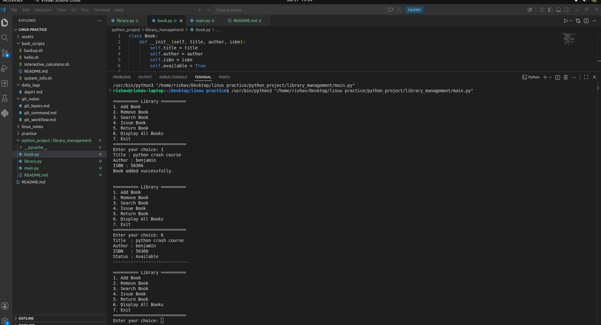

# 📚 Library Management System

A simple **Command Line Library Management System** built using **Python** and **Object-Oriented Programming (OOP)** concepts.

This project was created to strengthen my understanding of Python OOP concepts such as classes, objects, encapsulation, composition, and modular programming.

---

## 📸 Screenshot



---

## 🚀 Features

- ➕ Add a new book
- ❌ Remove a book
- 🔍 Search a book by ISBN
- 📖 Issue a book
- 🔄 Return a book
- 📋 Display all books
- 🚪 Exit the application

---

## 🛠 Technologies Used

- Python 3
- Object-Oriented Programming (OOP)

---

## 📂 Project Structure

```text
library_management/
│
├── images/
│     └── library_demo.png
│
├── book.py
├── library.py
├── main.py
└── README.md
```

---

## 📖 OOP Concepts Used

- Classes
- Objects
- Constructors (`__init__`)
- Methods
- Encapsulation
- Composition
- Lists of Objects
- Module Imports

---

## ▶️ How to Run

Clone the repository

```bash
git clone <repository-url>
```

Navigate to the project folder

```bash
cd library_management
```

Run the project

```bash
python main.py
```

---

## 📋 Sample Menu

```text
========== Library ==========
1. Add Book
2. Remove Book
3. Search Book
4. Issue Book
5. Return Book
6. Display All Books
7. Exit
=============================
```

---

## 📷 Sample Output

### Add Book

```text
Title : Python Crash Course
Author : Eric Matthes
ISBN : 12345

Book added successfully.
```

### Display Books

```text
Title  : Python Crash Course
Author : Eric Matthes
ISBN   : 12345
Status : Available
------------------------------
```

### Issue Book

```text
Enter ISBN : 12345

Book issued successfully.
```

### Return Book

```text
Enter ISBN : 12345

Book returned successfully.
```

---

## 📚 Learning Outcomes

Through this project, I practiced:

- Designing classes and objects
- Working with constructors and methods
- Managing collections of objects
- Building a menu-driven CLI application
- Organizing code into multiple Python modules
- Applying object-oriented design principles

---

## 🔮 Future Improvements

- Save library data using JSON
- Load data automatically when the program starts
- Prevent duplicate ISBN entries
- Search by title or author
- Add user authentication
- Add due dates and fine calculation
- Build a graphical user interface (GUI)

---

## 👨‍💻 Author

**Rishav Kumar Singh**

B.Tech – Computer Science & Design Engineering (CSD)

Currently learning:
- Python
- Computer Vision (OpenCV)
- Robotics
- Autonomous Drone Development